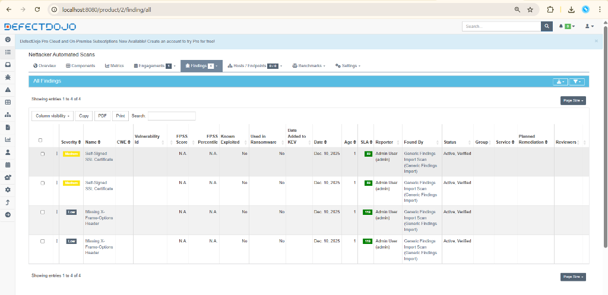

# Nettacker-DefectDojo Bridge

Welcome to the official showcase of the **Nettacker-DefectDojo Bridge**, a seamless integration tool that connects the scanning power of **OWASP Nettacker** with the vulnerability management capabilities of **DefectDojo**.

## 🚀 The Integration in Action

We have successfully bridged the gap. Below is a real-world example of Nettacker scan results automatically imported into DefectDojo using our bridge.



**What you are seeing:**
- **Automated Ingestion**: The findings above (SSL Certificate, X-Frame-Options) were *not* manually entered. They were parsed from Nettacker's JSON output.
- **Severity Mapping**: The bridge correctly maps "Medium" and "Low" severities from the scan to DefectDojo's model.
- **De-duplication**: DefectDojo handles repeated scans intelligently, updating existing findings rather than creating duplicates.

## 🛠️ How it Works

The workflow is simple yet powerful:

1.  **Scan**: Run `nettacker` against your target infrastructure.
2.  **Transform**: The `bridge.py` script normalizes the data for compatibility.
3.  **Push**: Results are securely uploaded to your DefectDojo Engagement.

```python
# The Secret Sauce (Snippet from bridge.py)
finding = {
    "title": item.get("module_name", "Unknown Vulnerability"),
    "severity": item.get("severity", "Info"),
    "description": "Automatically imported via Nettacker-DefectDojo Bridge.",
    "active": True,
    "verified": True
}
```

## 🛡️ Verifying Authenticity

**"How do I know these results are real?"**

The tool implements a **Digital Provenance Stamp** to ensure the integrity of your data. Every finding imported by this tool is automatically modified to include a verification footer.


### 📝 The Signature
Every finding gets appended with:

1.  **Origin Footer**: Signature including the Scan ID and Source Tool.
    ```text
    --------------------------------------------------
    **Origin:** Automated Import via Nettacker-DefectDojo Bridge
    **Source Tool:** OWASP Nettacker
    **Scan ID:** Automated Scan
    ```
2.  **Automated Tags**: Findings are tagged with `nettacker`, `automated`, and `defectdojo-bridge` for easy filtering.

This ensures that auditors can distinguish between manually entered findings and those verified by the automated scanner.

---
*Generated with MkDocs & Material for MkDocs*
